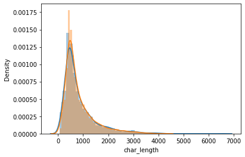
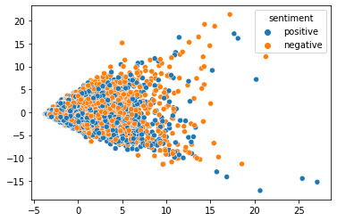

Here, we analyze whether review length is a deciding factor in determining if a review is negative or positive.

Result: Reviews with a length between 200 and 1000 characters have a slightly higher probability of being negative; 

however, review length is not the most prominent factor in determining sentiment.
